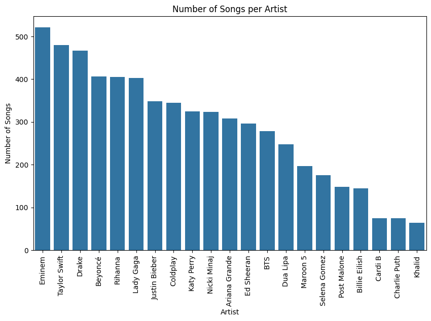
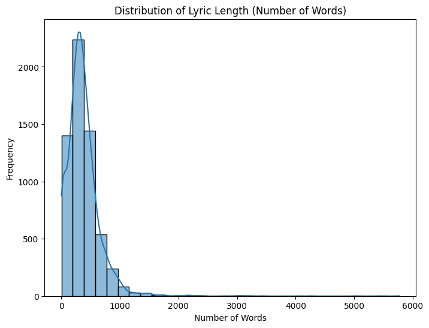
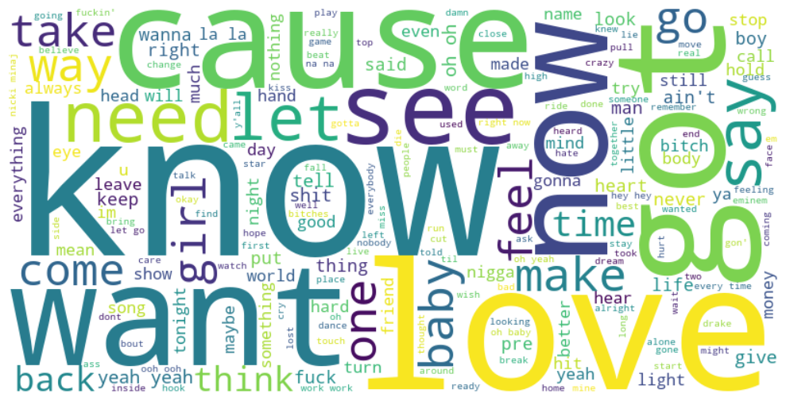

# **Text Generation (Song Lyrics)**

## **Content**

- [Problem Statement](#problem-statement)
- [Data Source](#data-source)
- [Exploratory Data Analysis (EDA)](#exploratory-data-analysis-eda)
- [Data Preprocessing](#data-preprocessing)
- [Model Building](#model-building)
- [`src/predict.py` - Prediction Script](#srcpredictpy---prediction-script)
- [Conclusion](#conclusion)

## **Problem Statement**

The goal of this project is to build a model that generates text based on an input sequence. This will involve using sequential models like RNN, LSTM, and GRU to create a system capable of generating coherent and contextually relevant text, drawing from a diverse collection of song lyrics. The project aims to explore how these models handle creative text generation and to compare their performance in generating text.

## **Project Structure**

```plain
Text_Generation/
├── data/                 
│   ├── raw/              
│   ├── processed/        
├── models/               
├── notebooks/            
│   ├── 01_data_collection.ipynb     # Collect and inspect the dataset
│   ├── 02_eda_visualization.ipynb   # Exploratory Data Analysis (EDA) of the dataset
│   ├── 03_data_preprocessing.ipynb  # Preprocess the text data (tokenization, embedding, padding)
│   ├── 04_modeling_rnn.ipynb        # Build, train, and evaluate the RNN model
│   ├── 05_modeling_lstm.ipynb       # Build, train, and evaluate the LSTM model
│   ├── 06_modeling_gru.ipynb        # Build, train, and evaluate the GRU model
├── src/                             
│   ├── predict.py                    # Script for making predictions with the trained model
├── plots/                           
├── README.md                        
├── requirements.txt
```

## **Data Source**

- **Dataset:** Song Lyrics
- **Description:** A collection of song lyrics from various genres and artists, useful for generating creative and rhythmic text.
- **Source:** [Song Lyrics Dataset on Kaggle](https://www.kaggle.com/datasets/deepshah16/song-lyrics-dataset/data)

## **Exploratory Data Analysis (EDA)**

This step involves exploring the dataset to gain insights into the distribution and patterns within the data.

### **Key Actions:**
- Check for missing values.
- Analyze the distribution of lyric lengths, artist contribution, and common words
- Generate visualizations such as word clouds, histograms, and artist frequency plots.

### **Findings**
- **Data Overview**
    - The dataset consists of **6 major columns**: `Artist`, `Title`, `Album`, `Year`, `Date`, and `Lyric`, with a total of **6027 rows**.
    - Key columns like Album, Year, and Date have missing values, while the Lyric column has only **46 missing entries**.
    - Most artists in the dataset have a significant number of songs, with **Eminem, Taylor Swift, and Drake** having the most entries.

- **Artist Distribution**
    - Artists like Eminem, Taylor Swift, and Drake have the highest representation, while artists like Khalid and Charlie Puth have fewer songs in the dataset.
    

- **Lyric Length**
    - Lyrics vary in length across songs, which was explored through the distribution of word counts.
    

- **WordCloud**
    - A visualization of frequently occurring words in the dataset; offering insights into common terms used in song lyrics.
    

## **Data Preprocessing**

In this phase, the lyrics data was cleaned and prepared for model training. These were the steps taken:

- **Text Cleaning:**
    - Expand contractions, convert text to lowercase, and remove special characters.
    - Remove stopwords and extra spaces.
- **Tokenization:**
    - Tokenize the cleaned lyrics using Keras’ `Tokenizer` to convert words to integer sequences.
    - Pad the sequences to ensure consistent input lengths for the model.
    - Save the tokenized sequences and the tokenizer in the `data/processed/` folder for further use.

## **Model Building**

In this phase, various sequential models—**RNN**, **LSTM**, and **GRU**—were built and trained to generate text from the tokenized song lyrics dataset. Each model was trained for 50 epochs to evaluate their performance in terms of accuracy and loss.

- **RNN Model:**

    After 50 epochs, the RNN model achieved the following results:
    ```plain text
    Epoch 50/50
    189/189 [==============================] - 94s 499ms/step - loss: 0.0508 - accuracy: 0.9922
    ```

- **LSTM Model:**

    The LSTM model demonstrated better performance with a lower loss and higher accuracy after 50 epochs:

    ```plain text
    Epoch 50/50
    189/189 [==============================] - 196s 1s/step - loss: 0.0365 - accuracy: 0.9934
    ```

- **GRU Model:**

    The GRU model, known for its efficiency, performed the best in terms of loss and accuracy:
    ```plain text
    Epoch 50/50
    189/189 [==============================] - 135s 713ms/step - loss: 0.0286 - accuracy: 0.9940
    ```

After comparing the models, the **LSTM** model was selected for deployment due to its strong balance of performance and training time. This model was saved and later used in the `predict.py` script for generating text predictions.

## **src/predict.py - Prediction Script**
This script allows for text generation based on a given input sequence using the trained model.

**Key Actions:**

- Load the trained model and tokenizer.
- Define the `generate_text()` function, which takes a `seed_text` and `num_words` (number of output words), and generates new words.
- Use the model to predict the next word based on the input sequence iteratively, generating text step by step.

```python
from keras.models import load_model
from keras.preprocessing.sequence import pad_sequences
import pickle
import numpy as np

# Load the model and tokenizer
model = load_model("../models/lstm_text_generation_model.keras")

with open("../models/tokenizer.pkl", "rb") as f:
    tokenizer = pickle.load(f)

# Function to generate new text
def generate_text(seed_text, num_words):
    for _ in range(num_words):
        token_list = tokenizer.texts_to_sequences([seed_text])[0]
        token_list = pad_sequences([token_list], maxlen=29, padding='pre')
        predicted = np.argmax(model.predict(token_list), axis=-1)
        output_word = ""
        for word, index in tokenizer.word_index.items():
            if index == predicted:
                output_word = word
                break
        seed_text += " " + output_word
    return seed_text
```

```python
seed_text = "you call me all"
generated_text = generate_text(seed_text, num_words=5)
print(generated_text)
```
```plain text
you call me all be cool released me right
```

**Usage Instructions**

**Install Dependencies:** Install the required libraries by running
```bash
pip install -r requirements.txt
```

## **Conclusion**
This project showcases how to build a text generation model using various sequential models such as RNN, LSTM, and GRU. By comparing their performances, we can determine the most effective approach to generating coherent and contextually relevant text based on input sequences.